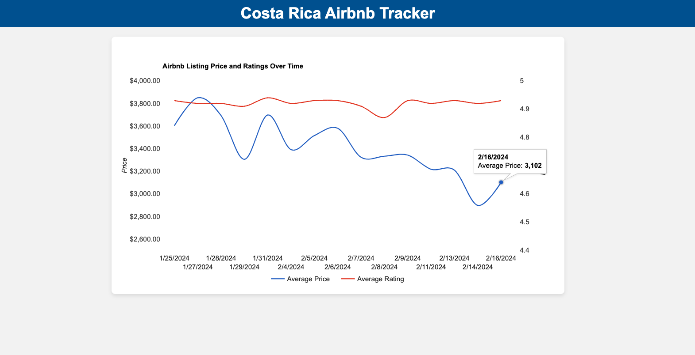
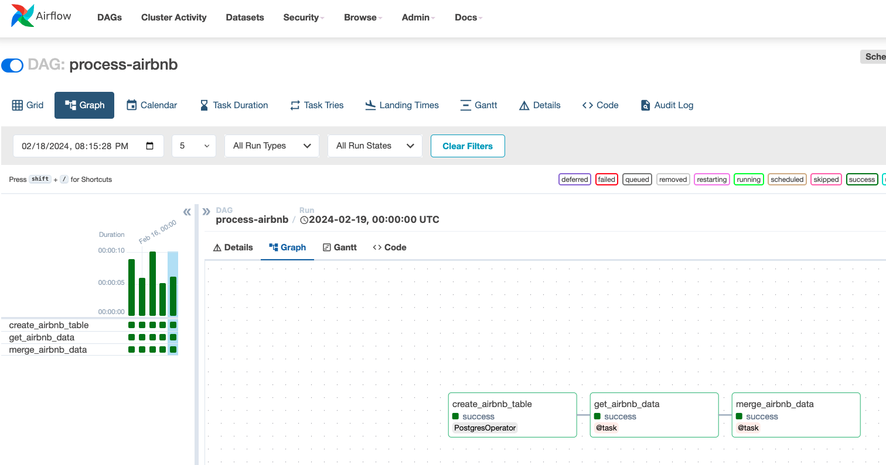

# Airbnb Price and Rating Tracker

## Purpose

This project is designed to help users monitor Airbnb listings for a specific trip they are considering, allowing them to identify the best time to make a booking based on historical price trends and listing ratings. Think [Hopper](https://hopper.com/product/price-prediction), but for Airbnb. This tool is particularly useful for travelers looking to optimize their expenses by booking when prices are low relative to historical averages without compromising on the quality of their stay, as indicated by consistent or improving ratings.

## Demo

Here's a sneak peek of the app in action (using Costa Rica September 2024 as an example):



## Architecture

The application is built using a microservices architecture, encapsulated in Docker containers for ease of deployment and isolation. It comprises several key components:

- **Airflow**: Manages daily tasks to fetch Airbnb listing data.
- **PostgreSQL**: Stores historical data of Airbnb listings, including prices and ratings.
- **Backend (Flask API)**: Serves processed data from PostgreSQL to the frontend.
- **Frontend**: Provides a user-friendly interface to visualize price trends and ratings over time.

Data is collected daily using Airflow, which runs a task to fetch data for a specific type of listing (e.g., Costa Rica in September 2024) from the Airbnb API. This data is then saved to a PostgreSQL database. The Flask backend reads from PostgreSQL to serve data to the frontend, where users can easily visualize price trends and rating changes over time.

## Getting Started

To run the Costa Rica Airbnb Tracker on your local machine, follow these steps:

1. Clone the repository:

```bash
git clone https://github.com/drakeweissman/airbnb_tracker.git
cd airbnb_tracker
```

2. Generate your own API key from RapidAPI for accessing Airbnb data:

[RapidAPI - Airbnb API](https://rapidapi.com/3b-data-3b-data-default/api/airbnb13/details)

3. Create a .env file in the root directory of the project and add your RapidAPI key:

```bash
AIRFLOW_UID=502
RAPIDAPI_KEY="your_rapidapi_key_here"
```

4. Customize the Airbnb listings you're interested in in tracking by modifying the `query_params` in the `airflow/dags/process_airbnb.py` file:

```python
query_params = {
    "location": "Costa Rica",
    "checkin": "2024-09-01",
    "checkout": "2024-09-30",
    "adults": "2",
    "children": "0",
    "infants": "0",
    "pets": "0",
    "page": "1",
    "currency": "USD"
}
```


5. Start the application using Docker Compose. ([Docker](https://www.docker.com/get-started) required):

```bash
docker-compose up -d
```

After completing these steps, you can access the application at [http://localhost](http://localhost) and [http://localhost:8080/dags/process-airbnb/grid](http://localhost:8080/dags/process-airbnb/grid) for the Airflow UI.



The Airflow UI is used to monitor and manage the data collection workflow. It provides insights into the schedule, execution, and status of the DAG responsible for fetching and storing Airbnb listing data.

For direct testing and query execution on your PostgreSQL database, use the following command:
```bash
docker-compose exec postgres psql -U airflow -d airflow
```